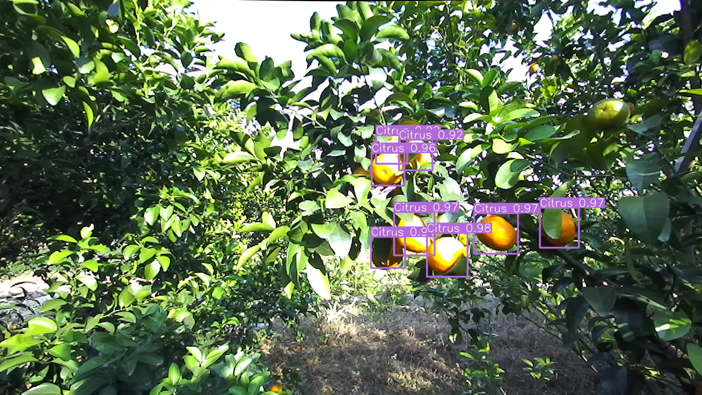
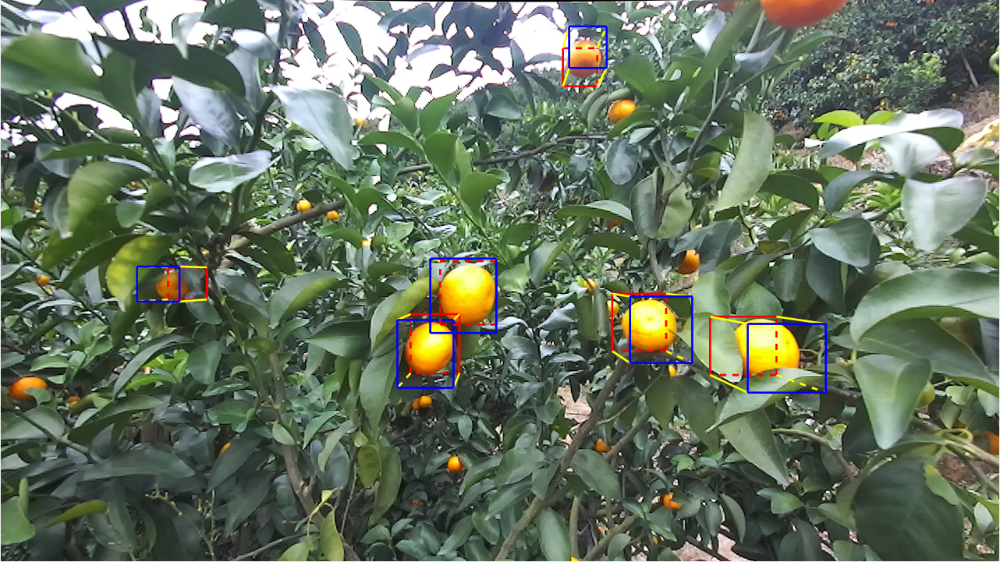

# The code of Detection and localization of citrus fruit based on improved YOLO v5s and binocular vision in the orchard.

 

### What we are doing and going to do

- [x] Upload the citrus dataset. [Google Drive](https://drive.google.com/drive/folders/1VfC0dWsXjhxyKIeAVNtHsxxjXx_2VvV6?usp=sharing)
- [x] Provide Reference image. [Google Drive](https://drive.google.com/drive/folders/1VfC0dWsXjhxyKIeAVNtHsxxjXx_2VvV6?usp=sharing)
- [x] Provide checkpoint model.[Google Drive](https://drive.google.com/drive/folders/1VfC0dWsXjhxyKIeAVNtHsxxjXx_2VvV6?usp=sharing)
- [x] Provide detection code.
- [ ] Provide localization code.
